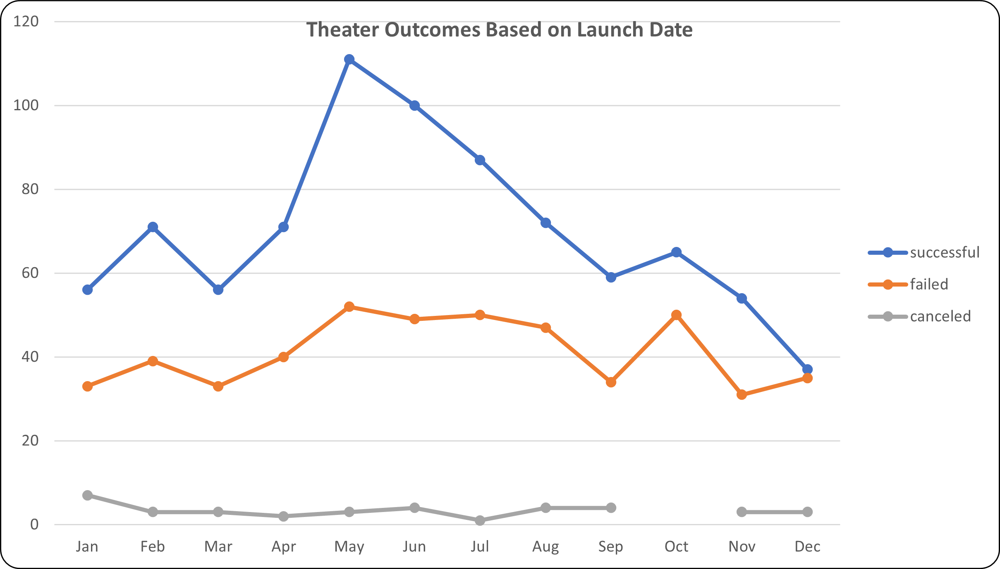

# What Makes a Kickstarter Campaign Successful?

## Overview of Project
This project will analyse a data set based on project launches over several years to gain insight on dependance on launch date and funding goal.

### Purpose
The purpose of the report is to provide an outline the how different fundraising campaigns fared in relation to their launch dates and their funding goals within the parent category 'theater' with a focus on the subcategory 'plays'. 

## Analysis and Challenges
The analysis of the dataset and challenges encountered are detailed beow.

### Analysis of Outcomes Based on Launch Date
An analysis of the dataset was performed in the parent category of theater. The data was placed in a pivot table with filters Parent Category and Years based on the launch date. The outcomes of the fundraisers were measured against the month the fundraiser was launched. The findings are documented in the Kickstarter Challenge Excel workbook and an embeded visual aid in the form of a stacked bar chart, Theater Outcomes Based on Launch Date is created to accompany the analysis. The chart is displayed below.

### Analysis of Outcomes Based on Goals
Further analysis was performed within the parent category of theater with a focus on the subcategory of plays. In this portion of the analysis the data was categorized by funding levels. The number of successful, failed and canceled fundraisers were examined within each funding level category as a ratio of outcome.  The findings of analysis of outcomes based on goals are displayed in a table format in the Kickstarter Challenge Excel Workbook and within the line chart labeled Outcomes Based on Goals.

### Challenges and Difficulties Encountered
The dataset was somewhat challenging in the way it was presented. Some adjustments had to be made to improve useability. The list below includes some challenges.
- The size of the dataset does not give way to do an analysis at a glance.
- The launch date and the deadline date were presented in the form of Unix timestamp and had to be converted to a readable form before analysis.
- Outliers in the dataset had to be dealt with to get a better understanding the central tendancies of the data set in regards to pledge and goal data.
- Categories and Subcategories were mrged in a single column and had to be separated prior to deep diving into the dataset.

## Results

- What are two conclusions you can draw about the Outcomes based on Launch Date?
    1. Inspecting the data within the Theater Outcomes Based on Launch Date chart reveals that the month that launched the most successful campaigns was May with June and July coming in at second and third place.
    2. It can als be determined that during the same time period the number of failed campaigns remained at the same level.

- What can you conclude about the Outcomes based on Goals?
    - The data indicate that the rate of success falls as the campaign goal increases.

- What are some limitations of this dataset?
    - Dataset carries values through the year 2017. This means that the newest data point in the dataset is four years old. We make an assumption that the funding trends have not changed in the last four years.
    - Current analysis is done on the full dataset with Parent Category of theater.  The data include information from many countries. The results may vary depending on which country the campaign is launched.

- What are some other possible tables and/or graphs that we could create?
    - In this analysis we looked at the the outcomes based on launch date. The trends seen could be an artifact of just having more or less campaigns started within any given month. If we examine the success rate as a percentage might give us more information independat of the number of the total campaigns launched.
    - As mentioned in the above section, the analysis is done on the a dataset that includes many countries. We could generate charts that separate the outcomes filtered by country we will be able to target our campaign to a specific region at a specif time.

